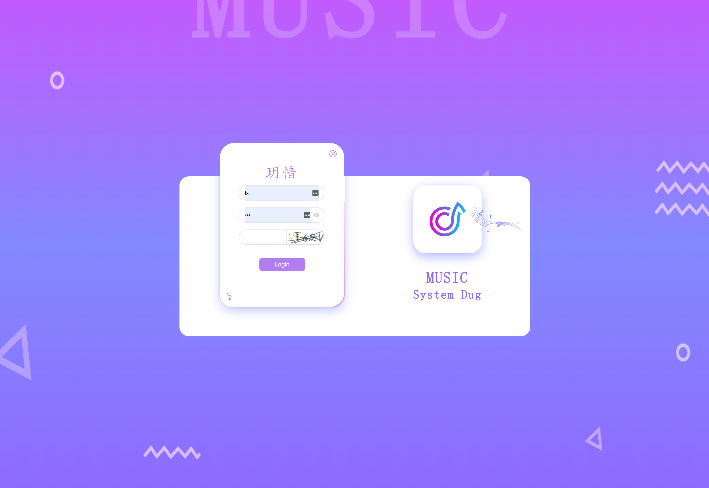
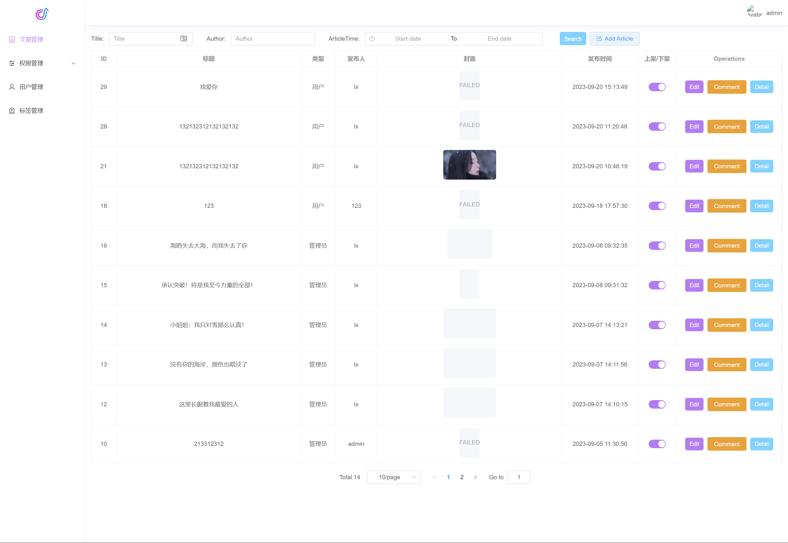

# Vue 3 + Vite + Element Plus 权限管理后台

## 基于Vite搭建的Vue3项目

简单的权限管理后台，包含登录、用户管理、角色管理、权限管理（包含菜单管理）、文章管理和文章评论、标签管理等功能。

<ul>
    <li>技术栈：Vue + Pinia + Vue-Router + Axios</li>
    <li>UI框架：Element Plus</li>
    <li>权限管理：RBAC</li>
    <li>Node.js 服务端 API 接口地址：https://github.com/LX-GQG/onlyBlog </li>    
</ul>

访问地址 https://ad.gqgwr.cn 账号是lx 密码123456

## 项目启动
```
# 进入项目根目录

cd onlyBlogAdmin

# 安装依赖包

npm install 或者 yarn install

# 启动 Vue3 Vite 项目

npm run dev 或者 yarn dev
```

## 项目截图
登录


404


用户管理


权限管理


文章管理


文章评论


标签管理

